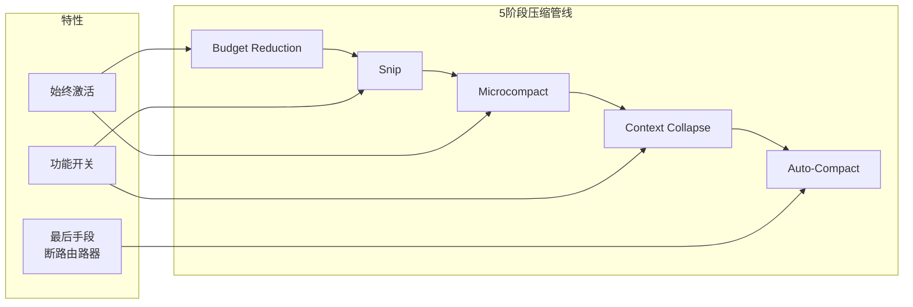

# 公众号发布指引：《Harness深度解析——当模型能力趋同，什么决定了智能体的上限？》

> 本文档为配套发布操作手册。文章正文见 `harness深度解析_公众号文章.md`。

---

## 一、发布前准备

### 1.1 素材清单

| 项目 | 状态 | 说明 |
|:---|:---:|:---|
| 文章正文 | ✅ 已就绪 | `harness深度解析_公众号文章.md` |
| 封面图 | ⏳ 需生成 | 见下方提示词 |
| 文中配图×3 | ⏳ 需生成 | 三张mermaid图需转为PNG |
| 作者署名 | ⏳ 需填写 | 建议：陈颖芳 / AI自由撰稿人 |

### 1.2 封面图（微信首图 900×383px）

**DALL·E 提示词**：

```
一张极具科技感的封面图。画面中心是一个半透明的二进制数字大脑，正在被精密机械臂环绕组装，象征"system scaling"——不是模型更大，而是系统更强。背景是深空蓝色到银灰色的渐变，有数据流如神经网络般闪烁。风格理性、冷静、有架构感。适合深度技术文章封面。文字区域左上角留白充分。宽高比 900:383。
```

备用（中文模型）：**通义万相 / 文心一格 / Midjourney** 均可，提示词同上。

---

## 二、文中插图处理（三张mermaid转图片）

微信编辑器不支持 mermaid 原生渲染。请将以下三处 mermaid 代码块截图/导出为 PNG，插入对应位置。

### 图1：操作系统 vs Agent Harness 类比（建议位置：2.2节后）

本文未使用mermaid图（表格为主），但建议制作一张**Claude Code 5层子系统架构图**作为视觉亮点：

**建议制作方法**：用PPT/PPT绘制架构层级堆叠图（5层：Surface→Core→Safety/Action→State→Backend），导出为PNG插入第2.3节末尾。比例建议16:9，字体清晰。

### 图2：5阶段压缩管线流程（建议位置：3.2节后）

**快速生成方法**：
1. 打开 https://mermaid.live/
2. 粘贴下方代码，导出 PNG
3. 上传微信素材库，插入正文



**图注**：Claude Code的5阶段上下文压缩管线，从最轻量到最重量级逐级递进，绝大多数情况在前3层完成压缩，Auto-Compact断路器在连续失败3次后停止。

### 图3：Harness五大设计原则（建议位置：第八节后）

```mermaid
graph TB
    subgraph Harness五大设计原则
        direction TB
        P1[Fail-closed > Fail-open] --> P2[Context is RAM]
        P2 --> P3[隔离比共享更安全]
        P3 --> P4[Append-only]
        P4 --> P5[每个组件都是假设]
    end
    P1 -.-> A[默认说"不"]
    P2 -.-> B[Token是推理预算]
    P3 -.-> C[正确性保证]
    P4 -.-> D[可追溯性即信任]
    P5 -.-> E[模型升级后复评假设]
```

**图注**：从Claude Code和Harness Engineering社区提炼的五大设计原则——每个原则都对应一个具体的架构决策方向。

---

## 三、微信编辑器操作步骤

```
Step 1: 登录 mp.weixin.qq.com → 素材管理 → 新建图文
Step 2: 用 Md2All（https://md.mtoall.com/）将 .md 转换为微信格式
        或：直接用135编辑器/秀米等工具导入 markdown
Step 3: 上传封面图（900×383）
Step 4: 在图1/图2/图3 对应位置插入已生成的PNG图片
Step 5: 添加作者署名
Step 6: 预览 → 检查格式（特别注意表格、引用块、代码块的渲染）
Step 7: 群发前做最后一轮预览到手机，确认排版
```

### 排版补丁

微信编辑器常见问题及对策：

| 问题 | 对策 |
|:---|:---|
| 表格错位 | 在135编辑器/秀米中编辑表格，不要直接在微信原生编辑器操作 |
| 引用块样式丢失 | 选中文字 → 点击编辑器工具栏的"引用"图标（或手动添加灰色底色） |
| 代码块无背景色 | 用编辑器"代码块"功能重新包裹 |
| 字体大小不统一 | 正文推荐15px，标题推荐18-20px，注释推荐13px |
| 行间距 | 推荐1.75倍行距，段落之间空一行 |
| 三问区块 | 结尾的"三个问题"部分建议用加粗+引用的方式突出，增加互动感 |

---

## 四、发布检查清单

- [ ] 封面图已上传（900×383）
- [ ] 3张配图已插入正确位置
- [ ] 所有引用链接可点击
- [ ] 作者署名已填写
- [ ] 文末"封面图：DALL·E 生成 | 发布日期：2026-06-03"已保留
- [ ] 手机预览检查无排版问题
- [ ] 已选择正确的合集标签（如"AI深度思考"）
- [ ] 声明原创（如适用）
- [ ] 末尾三个引导问题已确认可显示

---

## 五、发文后传播建议

1. **朋友圈转发语**："花了些时间研究Claude Code的harness架构。当模型能力趋同，什么决定了智能体的上限？不是更聪明的模型，是更好的系统。这篇文章试图回答这个问题。欢迎讨论。"
2. **行业群分享**：建议发到AI技术社群、ML工程讨论组，附上结尾三问引导讨论
3. **互动引导**：发文后1小时内回复前三条评论，激活推荐算法。重点回应对$191验证成本、五大原则等问题的反馈
