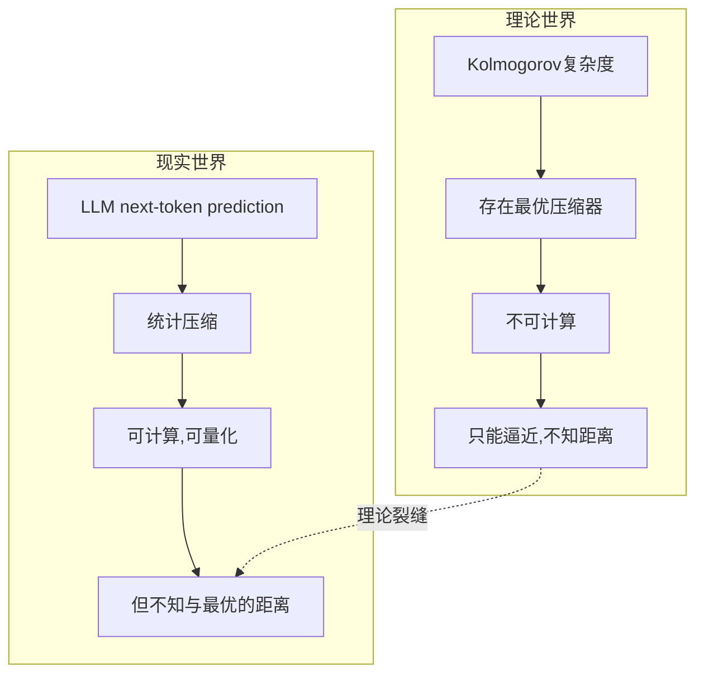

# 压缩即智能？——一个美丽假说的裂缝与边界

> 又一篇吹捧"压缩=智能"的文章？不，这次我们来拆台。
>
> Ilya Sutskever的命题很美，但作为AI从业者，你有权知道它在哪里成立、在哪里崩塌。

---

## 一、引子：AI圈最诱人的命题

2023年，Ilya Sutskever在Simons Institute的一场演讲中抛出了一个令整个AI圈精神一振的命题。

他说的是预测与压缩的信息论等价性，但人们听到的是另一句话：

**压缩即智能。**

逻辑链条优美得令人窒息：

```
下一个token预测 → 最小化预测误差 → 最小化编码长度 → 最大化压缩率
→ 发现数据规律 → 泛化能力 → 智能
```

这个命题的力量在于它连接了三座大山：

- **Kolmogorov复杂度**（1960s）：数据的本质信息量 = 能生成它的最短程序长度
- **Solomonoff归纳推理**（1960s）：最优预测器 = 在全体程序中挑出最短的那个
- **Hutter AIXI**（2000s）：最优决策 = 持续压缩历史数据并据此行动

半个世纪的理论积累，被一个简单的口号收束。它太美了，美到让人不忍心质疑。

但它真的成立吗？

---

## 二、"压缩即智能"的说服力从哪来？

### 2.1 它有一个让你无法反驳的直觉基础

作为AI从业者，你每天都在和这个直觉打交道：

- 一个好的特征提取器 = 能去除冗余、保留本质的提取器
- 一个好的模型 = 用最少的参数拟合最多的数据
- 没有过拟合的模型 = 学会了"真规律"而非"噪声"

**"压缩即智能"本质上是对奥卡姆剃刀的信息论重写：最简单的解释是最好的解释。**

没有比这更符合科学直觉的命题了。

### 2.2 LLM的成功是它最响亮的证据

GPT的训练目标是什么？最大化下一个token的对数似然——信息论上等价于最小化编码长度——等价于最大化压缩率。

然后GPT-4能写诗、能编程、能推理。

如果你是一个相信"压缩即智能"的人，你会说：**看，我们压出来的。"

这个叙事太自洽了，以至于它成了一种精神信仰——每当有人质疑"LLM真的有智能吗"，"压缩即智能"就被搬出来作为理论武器。

但作为一个AI从业者，你可能隐约感到哪里不对。那些你在训练中遇到的诡异失败——简单的逻辑错误、荒谬的幻觉、因果推理的崩塌——如果"压缩即智能"真的成立，为什么这些现象还存在？

### 2.3 一个不能回避的正向证据

在进入批判之前，必须对"正方"最有力的实证证据给予公平对待。

2024年，HKUST的Huang等人在论文《Compression Represents Intelligence Linearly》（[arXiv:2404.09937](https://arxiv.org/abs/2404.09937)）中，对30+个公开LLM进行了系统评测，发现了一个惊人的结果：模型的压缩能力（以BPC——bits per character——衡量）与下游任务表现之间的Pearson相关系数高达 **-0.95**。

这是一个接近完美的线性相关。

你压得越好，你表现得就越好。这看起来是对"压缩即智能"最直接的实证背书。

但这个证据恰恰需要我们**更加谨慎**。该研究测量的是**统计压缩**（Shannon意义上的BPC），而非**算法压缩**（Kolmogorov意义上的最短程序）。-0.95告诉我们压缩与智能高度相关，但相关不等于等价。更重要的是，统计层面的"压得好"是否触及了智能的根本机制，仍是开放问题。

带着这个证据——以及它留下的问号——让我们进入对这个命题的批判性审视。

让我们认真看看这个命题的裂缝。

---

## 三、裂缝一：最优压缩器是一个幽灵

这是理论层面的第一刀，也是最致命的一刀。

Kolmogorov复杂度的定义是"生成该数据的最短程序长度"。但问题是：

**不存在一个通用算法，能对任意输入数据计算出它的Kolmogorov复杂度。**

这是图灵停机问题的直接推论。你永远无法确定是否找到了"最短"程序——总可能存在一个更短的，但你需要无穷的时间去验证它。

这意味着什么？

**"最优压缩器"是一个理论上存在、但现实中不可企及的幽灵。** 所有现实的压缩都是近似——而且是"不知道离最优有多远"的近似。

当你宣称"LLM通过next token prediction逼近最优压缩"时，你实际上是在说：

> "我在一个不知道距离尺度的空间里，向一个不知道位置的目标移动。"

这更像是信仰，而不是科学。



---

## 四、裂缝二：LLM做的是统计压缩，不是算法压缩

这是第二个核心误解，也是最容易被忽略的。

让我们用一张表格看明白两个概念的根本区别：

| 对比维度 | Shannon熵（统计压缩） | Kolmogorov复杂度（算法压缩） |
|:---|:---|:---|
| **操作对象** | 概率分布 p(x) | 确定性序列 x |
| **核心方法** | 统计频率，计算熵 | 寻找最短生成程序 |
| **可计算性** | ✅ 可计算 | ❌ 不可计算 |
| **本质内涵** | 数据的不确定性度量 | 数据的本质结构复杂度 |
| **LLM擅长吗** | ✅ 这是它的主场 | ❌ 并不擅长 |

**LLM的工作原理是Shannon意义上的统计压缩**——它在学习 token 序列的概率分布 p(x₁, x₂, ..., xₙ)，然后从这个分布中采样。

它不（也不能）寻找一个能"生成"训练数据的最短程序。

这两个概念可以通过算术编码建立联系——一个足够好的概率模型确实可以转化为一个压缩器。但它们是**本质不同的操作**，指向**不同的智能类型**。

2026年发表在 *Nature Communications* 上的 **SuperARC** 论文（[原文链接](https://link.springer.com/article/10.1038/s41467-026-73289-5)）给出了一组发人深省的结论：

SuperARC证明：预测能力在算法空间中的压缩与在统计空间中的压缩之间存在**根本差异**。前沿LLM展示的是碎片化的、渐进式的进步，其表现主要受限于统计层面的模式匹配能力，而非真正的算法模型合成。在需要递归预测能力递增的测试中，LLM表现脆弱，而一个基于算法信息论的混合神经符号方法则显著胜出。

翻译成大白话：

> **LLM压扁了数据的外在统计模式，但没有理解数据的内在生成结构。**

如果你的"智能"定义是"理解内在生成结构"，那LLM的压缩是在一条错误的道路上走得越来越快。

---

## 五、裂缝三：人类根本不是一个最优压缩器

如果"压缩即智能"是真的，那么人类——目前地球上最智能的物种——应该是一个比AI更优的压缩器。

至少，越智能的模型，它的认知结构应该越接近人类。

**但实证结果恰好相反。**

这是 **LeCun团队2025年的论文《From Tokens to Thoughts》** 的核心发现（[arXiv:2505.17117](https://arxiv.org/abs/2505.17117)）。

实验揭示了一个令人不安的分化：

```mermaid
graph LR
    subgraph LLM压缩策略——统计最优
        A1[概念边界高度锐利] --> A2[冗余极小化]
        A2 --> A3[让金丝雀和企鹅在'鸟'概念上同等典型]
        A3 --> A4[丧失了典型性判断能力]
    end
    subgraph 人类压缩策略——功能冗余
        B1[概念边界模糊] --> B2[保留大量看似低效的结构]
        B2 --> B3[金丝雀比企鹅更'像鸟']
        B3 --> B4[换来了灵活性·跨域类比·社会沟通]
    end
```

**更要命的是：scaling law在这一具体维度（概念结构的人类相似度）上失效了。** 模型越大，它的概念结构并**没有**变得更像人类。它不是逼近人类认知的一个更好的近似，而是在一条完全不同的道路上越走越远。

这就引出了一个尖锐的问题：

> **如果一个在认知结构上与人类完全不同的系统在某些任务上超越了人类，我们是否还应该称它为"智能"？**

或者更激进一点：**人类认知中那些看似"低效"的结构——模糊的概念边界、情绪的干扰、隐喻的跳跃——它们不是智能的缺陷，而是智能的代价。**

压缩到极致，恰恰会丢失这些。

---

## 六、裂缝四：智能是多维的，压缩只覆盖了其中一维

即便我们慷慨地承认压缩是智能的重要维度，它也只是**之一**。

让我们做一个小练习——列一个"智能清单"，看看压缩能解释哪些：

| 智能维度 | 压缩能解释吗？ | 为什么 |
|:---|:---:|:---|
| **模式识别** | ✅ 能 | 这是压缩的核心机制 |
| **预测** | ✅ 能 | 预测与压缩信息论等价 |
| **因果推理** | ❌ 不够 | 相关≠因果，压缩能找到correlation但找不出causation |
| **创造力** | ❌ 不够 | 好奇心可视为"压缩进步"的追求——既有扩展也有边界 |
| **社会智能** | ❌ 不够 | 理解他人意图、合作、博弈——压缩可能是基础但远远不够 |
| **元认知** | ❌ 不够 | "知道自己知道什么、不知道什么"——压缩模型没有这个结构 |
| **目标导向** | ❌ 不够 | "为什么做A而不是B"——压缩模型无法回答这个问题 |

当一个命题需要用"你理解得太窄了，我说的智能是广义的"来为自己辩护时，它已经从科学的假说滑向了哲学的信仰。

---

## 七、裂缝五：压缩到极致 = 不可理解

这是最被忽视、但也可能是最重要的问题。

**Michael Timothy Bennett在2021年的论文**（[*Compression, The Fermi Paradox, and Artificial Super-Intelligence*](http://export.arxiv.org/pdf/2110.01835)）提出了一个令人不安的思想实验：

> 一个追求最优压缩的超级智能，其内部表示会压缩到何种程度？

答案是：**压缩到对人类而言完全随机的程度。**

因为最优压缩器不会保留任何"便于人类理解"的冗余——那些冗余本身就是信息量的浪费。一个真正的最优压缩器，其内部状态对任何第三方观察者而言，与白噪声无异。

这就产生了一个深刻的悖论：

```
压缩即智能 → 最优压缩器 = 最智能系统
最智能系统 → 内部表示不可理解
不可理解的系统 → 无法信任、无法控制
```

Bennett的结论更加激进：**"要保证一个AGI的可解释性和可控性，可能需要在某种层面上限制它的认知能力。"**

换句话说，**如果你想要一个你可以理解的智能体，你必须在它的"智能程度"上做妥协。**

这不是一个技术问题——这是一个文明治理问题。

---

## 八、那智能还缺什么？

批判不是为了否定，而是为了定位。

"压缩"是一个深刻而重要的视角，但它不是全景。当前，多条研究路线正在探索压缩之外的智能要素：

### 8.1 因果推理 —— Judea Pearl

Pearl几十年来反复强调：**"因果关系是智能的下一场革命。"**

压缩模型擅长发现"当X出现时Y也出现"的统计规律，但无法区分"X导致Y"、"Y导致X"、"Z同时导致X和Y"这三种完全不同的情况。

一个不会问"为什么"的系统，即使压缩率再高，也只是一个高级模式匹配器。

### 8.2 世界模型 —— Yann LeCun

LeCun的路线认为：真正的智能需要**多模态、具身化的世界模型**——不是通过压缩文本学习语言统计规律，而是通过与环境互动学习物理世界的因果结构。

压缩纯文本，相当于**"通过阅读菜谱学习烹饪"**：你可以背下所有菜谱的统计规律，可以生成看起来完美的菜谱续写，但你从未真正煎过一个鸡蛋。

### 8.3 结构与组合性 —— Ziming Liu

Liu在2025年发表的博客文章《Achieving AGI Intelligently – Structure, Not Scale》中提出（[原文链接](https://kindxiaoming.github.io/blog/2025/structuralism-ai/)）：

不同任务类型有不同的"可压缩性"：
- **物理类任务**：高度可压缩（几条定律就够）
- **化学类任务**：中等可压缩（需要更多参数）
- **生物类任务**：弱可压缩（本质上是统计的）

当前LLM对所有任务都使用"生物类策略"——用统计暴力硬压。这在一定规模内有效，但**效率极低**。结构主义AI建议在模型中显式构建层次组合性（如KAN网络），而不是把所有压缩任务扔给一个神经网络。

### 8.4 好奇心的数学化 —— Jürgen Schmidhuber

Schmidhuber的理论有趣之处在于：**它恰恰是对"压缩即智能"命题的扩展，而非否定。**

从1990年代起，Schmidhuber就建立了"好奇心作为压缩进步（compression progress）"的数学框架。在他的理论中：
- 主观"有趣" = 当前模型下数据的可压缩性
- 好奇心奖励 = 可压缩性的**变化率**（压缩进步的速率）
- 完全已知（压缩率不再增加）和完全未知（无法压缩）的模式都让人厌倦
- 只有"我能学会但还没学会"的模式才激发好奇心

换言之，Schmidhuber没有抛弃压缩——他把压缩从**静态**的"当前压缩率"升级为**动态**的"压缩进步率"。智能体不是因为压得好而智能，而是因为**持续寻找可以压得更好的新领域**而智能。


**这个洞见弥合了一个关键裂缝**：压缩本身是"被动的"，但好奇心驱动的压缩进步是"主动的"。智能不是来自被动的压缩，而是来自对"可以进一步压缩"的持续追寻。

---

## 九、结语：一个美丽假说的正确位置

"压缩即智能"是一个美丽到令人窒息的假说。它用最少的假设连接了信息论、计算理论和机器学习经验的洪流。

但它不是完整的答案。

**作为透镜，它照亮了：**

- 为什么next token prediction如此有效
- 为什么更大的模型、更多的数据会产生更好的结果
- 为什么泛化能力与压缩率之间存在正相关关系

**但作为理论，它遮蔽了：**

- 智能中主动探索的成分
- 因果推理与统计关联的本质区别
- 人类智能中那些看似"低效"但实为功能必要的冗余
- 多维智能中无法被压缩所覆盖的维度

也许，"压缩即智能"不是在描述一个已经完成的事实，而是在**指引一个尚未到达的方向**。它告诉我们：当我们能真正压缩世界中的所有数据时——包括物理法则、因果关系、人类意图——那个系统才可能是真正智能的。

但在那之前，我们还需要更多的透镜。

---

### 留给你的三个问题

1. **关于理解：** 如果一个系统能把莎士比亚全集压缩成一段白噪声，它是否真的"理解"了莎士比亚？

2. **关于信任：** 如果一个模型在所有NLP基准上超越人类，但它的内部表示对你而言完全是黑箱——你称之为"智能"吗？你敢让它做医疗诊断吗？

3. **关于冗余：** 人类的梦境、情绪、直觉——那些认知科学家一度认为的"低效冗余"——它们是智能的缺陷，还是智能的代价？

欢迎在评论区写下你的思考。

---

*本文为独立研究写作，关键数据点经独立来源交叉验证。引用来源见文中链接。*

*封面图：DALL·E 生成 | 发布日期：2026-06-03*
