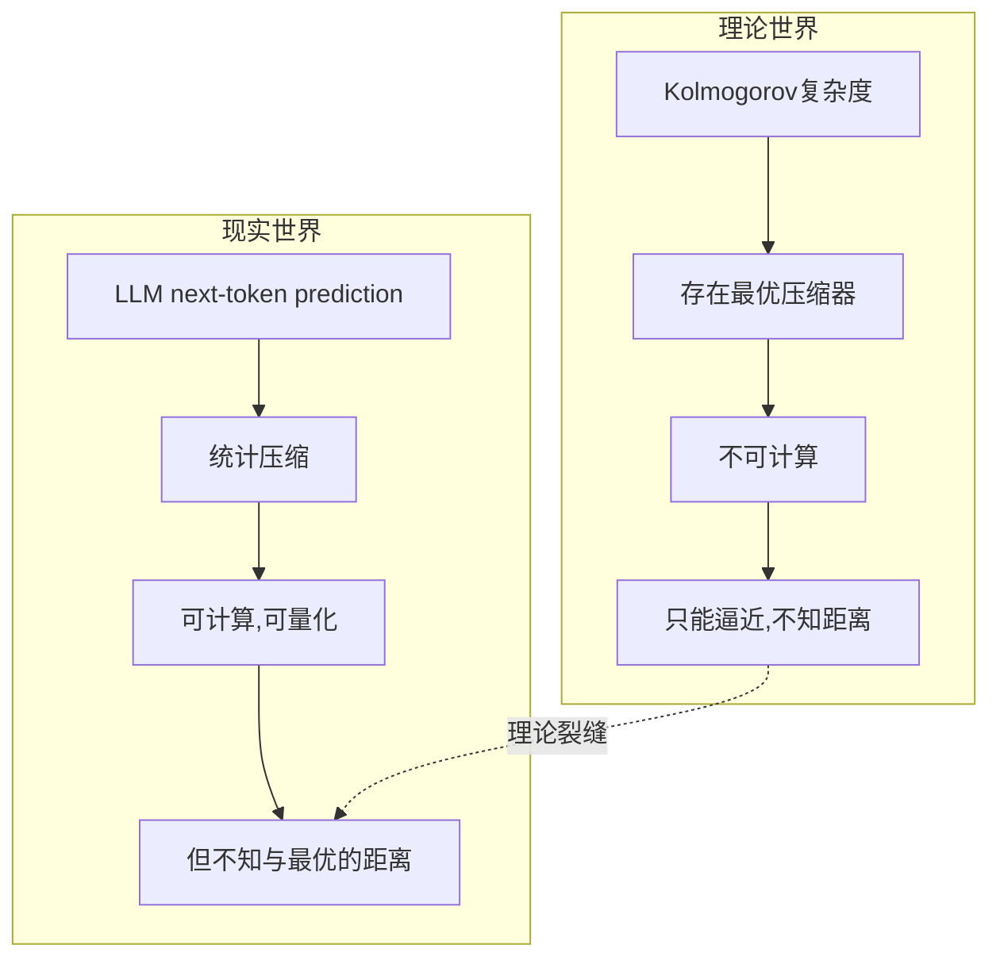
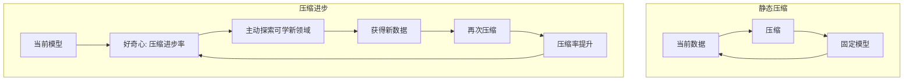

# 公众号发布指引：《压缩即智能？——一个美丽假说的裂缝与边界》

> 本文档为配套发布操作手册。文章正文见 `压缩即智能_公众号文章.md`。

---

## 一、发布前准备

### 1.1 素材清单

| 项目 | 状态 | 说明 |
|:---|:---:|:---|
| 文章正文 | ✅ 已就绪 | `压缩即智能_公众号文章.md` |
| 封面图 | ⏳ 需生成 | 见下方提示词 |
| 文中配图×3 | ⏳ 需生成 | 三张mermaid图需转为PNG |
| 作者署名 | ⏳ 需填写 | 建议：陈颖芳 / AI自由撰稿人 |

### 1.2 封面图（微信首图 900×383px）

**DALL·E 提示词**：

```
一张极具科技感和哲思的封面图。画面中心是一个透明的水晶立方体，正在被无形的力量压缩，从立方体逐渐变成一个发光的点。背景是深蓝色到紫色渐变的星空，有数字代码流像瀑布一样落下。风格克制、冷静、有学术感。适合作为深度技术文章的封面。文字区域留白充分，左上角适合放置标题。宽高比 900:383。
```

备用（中文模型）：**通义万相 / 文心一格 / Midjourney** 均可，提示词同上。

---

## 二、文中插图处理（三张mermaid转图片）

微信编辑器不支持 mermaid 原生渲染。请将以下三处 mermaid 代码块截图/导出为 PNG，插入对应位置。

### 图1：统计压缩 vs 算法压缩的鸿沟

*位置：第三节末尾，`裂缝一：最优压缩器是一个幽灵` 之后*

**快速生成方法**：
1. 打开 https://mermaid.live/
2. 粘贴下方代码，导出 PNG
3. 上传微信素材库，插入正文



**图注**：理论世界的最优压缩器不可计算，现实世界的统计压缩可计算但不知与最优的距离——二者之间的鸿沟是"压缩即智能"的第一个理论裂缝。

### 图2：LLM vs 人类的压缩策略分野

*位置：第五节 `裂缝三：人类不是最优压缩器`*

**mermaid.live 粘贴代码**：

```mermaid
graph LR
    subgraph LLM压缩策略——统计最优
        A1[概念边界高度锐利] --> A2[冗余极小化]
        A2 --> A3[让金丝雀和企鹅在'鸟'概念上同等典型]
        A3 --> A4[丧失了典型性判断能力]
    end
    subgraph 人类压缩策略——功能冗余
        B1[概念边界模糊] --> B2[保留大量看似低效的结构]
        B2 --> B3[金丝雀比企鹅更'像鸟']
        B3 --> B4[换来了灵活性·跨域类比·社会沟通]
    end
```

**图注**：LeCun团队2025年实证发现，LLM追求统计最优压缩，概念边界高度锐利但丢失了典型性判断；人类保留功能冗余，换来了灵活性和跨域类比能力。

### 图3：静态压缩 vs 压缩进步

*位置：第8.4节 `好奇心的数学化`*

**mermaid.live 粘贴代码**：



**图注**：Schmidhuber将静态压缩升级为动态的"压缩进步"——智能不是来自被动的压缩，而是来自对"可以进一步压缩"的持续追寻。

---

## 三、微信编辑器操作步骤

```
Step 1: 登录 mp.weixin.qq.com → 素材管理 → 新建图文
Step 2: 用 Md2All（https://md.mtoall.com/）将 .md 转换为微信格式
        或：直接用135编辑器/秀米等工具导入 markdown
Step 3: 上传封面图（900×383）
Step 4: 在图1/图2/图3 对应位置插入已生成的PNG图片
Step 5: 添加作者署名
Step 6: 预览 → 检查格式（特别注意表格、引用块、代码块的渲染）
Step 7: 群发前做最后一轮预览到手机，确认排版
```

### 排版补丁

微信编辑器常见问题及对策：

| 问题 | 对策 |
|:---|:---|
| 表格错位 | 在135编辑器/秀米中编辑表格，不要直接在微信原生编辑器操作 |
| 引用块样式丢失 | 选中文字 → 点击编辑器工具栏的"引用"图标（或手动添加灰色底色） |
| 代码块无背景色 | 用编辑器"代码块"功能重新包裹 |
| 字体大小不统一 | 正文推荐15px，标题推荐18-20px，注释推荐13px |
| 行间距 | 推荐1.75倍行距，段落之间空一行 |

---

## 四、发布检查清单

- [ ] 封面图已上传（900×383）
- [ ] 3张配图已插入正确位置
- [ ] 所有引用链接可点击（微信编辑器支持外链跳转？如不支持，考虑转为文末参考列表）
- [ ] 作者署名已填写
- [ ] 文末"封面图：DALL·E 生成 | 发布日期：2026-06-03"已保留
- [ ] 手机预览检查无排版问题
- [ ] 已选择正确的合集标签（如"AI深度思考"）
- [ ] 声明原创（如适用）

---

## 五、发文后传播建议

1. **朋友圈转发语**："花了两周思考压缩即智能这个命题，写了篇批判性长文。不是要否定，而是想帮大家看清楚这个美丽假说在哪里成立、在哪里崩塌。欢迎讨论。"
2. **行业群分享**：建议发到AI技术社群、机器学习讨论组，附上三个结尾问题引导讨论
3. **互动引导**：发文后1小时内回复前三条评论，激活推荐算法
